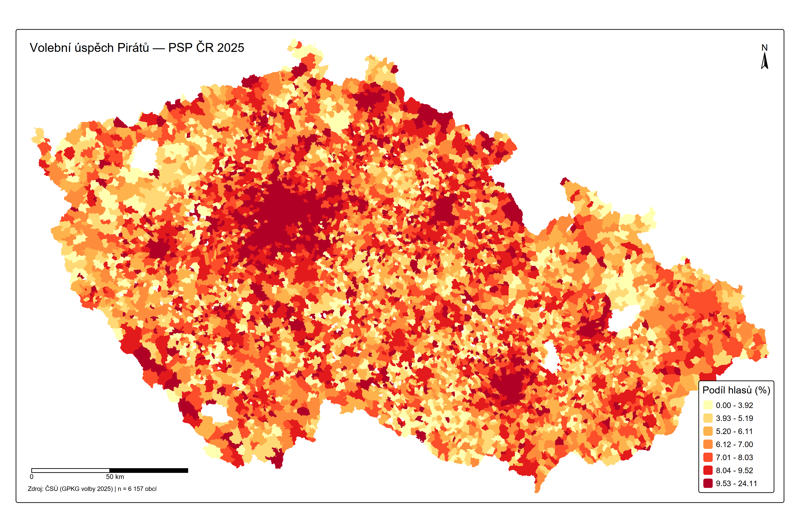
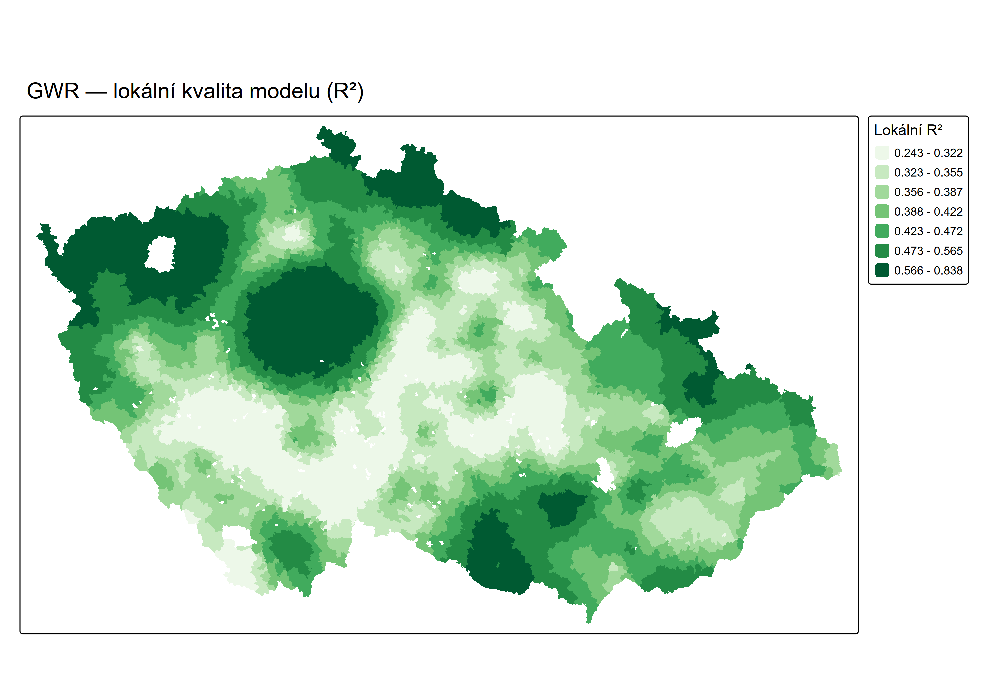

# Analýza volebního úspěchu Pirátů — PSP ČR 2025

[](https://www.r-project.org/)
[](https://cran.r-project.org/package=GWmodel)
[](LICENSE)

Prostorová analýza volebního úspěchu České pirátské strany na úrovni obcí s využitím **Geographically Weighted Regression (GWR)**.

## 📊 Klíčové výsledky

| Metrika | OLS | GWR | Zlepšení |
|---------|-----|-----|----------|
| R² | 0.188 | 0.445 | +25.6 p.p. |
| Adjusted R² | 0.188 | 0.300 | +11.2 p.p. |
| AICc | 29 130 | 28 601 | -529 |
| Moran's I reziduí | 0.080*** | -0.002 (ns) | ✓ Eliminováno |

**Hlavní zjištění:** Lokální koeficienty mění znaménko napříč územím — vztah mezi vzděláním a volební podporou Pirátů není všude stejný.

## 🗺️ Ukázky výstupů

<table>
<tr>
<td><br><em>Volební úspěch Pirátů</em></td>
<td><br><em>Lokální R² GWR modelu</em></td>
</tr>
</table>

## 📁 Struktura projektu

```
Pogeo2026/
├── R/                              # R skripty
│   ├── 01_gwr_analyza.R           # Hlavní analýza (EDA → OLS → GWR)
│   ├── 02_vizualizace.R           # Mapové vizualizace (tmap)
│   └── 03_finalizace_projektu.R   # Export GPKG + finální výstupy
│
├── data/
│   ├── raw/                        # Zdrojová data
│   │   └── gpkg.zip               # Volební data ČSÚ (GPKG)
│   └── processed/
│       └── pirati_final.gpkg      # Finální dataset pro ArcGIS
│
├── output/
│   ├── figures/                    # Grafy (PNG)
│   ├── maps/                       # Mapy (PNG)
│   └── tables/                     # Tabulky (CSV)
│
├── docs/                           # Dokumentace
│   ├── ANALYZA_POSTUP_FINAL.txt   # Kompletní metodika a interpretace
│   └── ARC_GIS_INSTRUKCE.txt      # Návod pro ArcGIS Pro
│
├── sldb2021_obce_indikatory.csv   # SLDB 2021 prediktory
└── README.md                       # Tento soubor
```

## 🚀 Spuštění analýzy

### Požadavky
- R ≥ 4.3
- Balíčky: `sf`, `spdep`, `GWmodel`, `car`, `ggplot2`, `tmap`, `dplyr`, `tidyr`, `corrplot`

### Instalace balíčků
```r
install.packages(c("sf", "spdep", "GWmodel", "car", "ggplot2", 
                   "tmap", "dplyr", "tidyr", "corrplot", "moments"))
```

### Spuštění
```r
setwd("cesta/k/Pogeo2026")

# 1. Hlavní analýza (~10-15 min)
source("R/01_gwr_analyza.R")

# 2. Finalizace a export (~1 min)
source("R/03_finalizace_projektu.R")
```

## 📈 Metodika

### Data
- **Volební data:** ČSÚ GPKG — volby do PSP ČR 2025
- **Prediktory:** SLDB 2021 (6 proměnných)
- **Jednotky:** 6 157 obcí (po filtraci)

### Prediktory v modelu
| Prediktor | Popis | OLS koef. | Směr |
|-----------|-------|-----------|------|
| VZDELANI_VYSOKO | Podíl VŠ vzdělaných | +0.112 | ↑ |
| VZDELANI_STR_BEZ | Podíl vyučených bez maturity | -0.079 | ↓ |
| NEPRAC_DUCH | Podíl nepracujících důchodců | -0.022 | ↓ |
| PODNIKATELE | Podíl podnikatelů/OSVČ | +0.071 | ↑ |
| NEZAMEST | Míra nezaměstnanosti | -0.037 | ↓ |
| VERICI | Podíl věřících | -0.020 | ↓ |

### GWR specifikace
- **Kernel:** Exponential (adaptive)
- **Bandwidth:** 23 sousedů
- **Optimalizace:** AICc

## 📋 Výstupy

### Tabulky (output/tables/)
| Soubor | Obsah |
|--------|-------|
| `03_ols_koeficienty.csv` | OLS koeficienty a p-hodnoty |
| `05_kernel_comparison.csv` | Porovnání 3 kernelů GWR |
| `06_moran_ols_vs_gwr.csv` | Moran's I před/po GWR |
| `07_model_summary.csv` | Souhrnné porovnání OLS vs GWR |

### Mapy (output/maps/)
| Soubor | Obsah |
|--------|-------|
| `01_mapa_pirati_uspech.png` | Volební úspěch Pirátů |
| `02_mapa_rezidua_ols.png` | Rezidua OLS modelu |
| `03_mapa_local_R2.png` | Lokální R² GWR |
| `04-06_coef_*.png` | Lokální koeficienty (3 mapy) |

### GeoPackage (data/processed/)
- `pirati_final.gpkg` — vrstva `gwr_final` pro ArcGIS Pro

## 🗺️ ArcGIS Pro

Import `data/processed/pirati_final.gpkg` a nastavte symbologii:

| Mapa | Field | Klasifikace | Barvy |
|------|-------|-------------|-------|
| Volební úspěch | `pirati_pct` | Quantile, 7 | YlOrRd |
| Rezidua OLS | `resid_ols` | Quantile, 7 | RdBu (midpoint=0) |
| Lokální R² | `local_R2` | Quantile, 7 | BuPu |
| Lok. koeficienty | `coef_*` | Jenks, 7 | RdBu (midpoint=0) |

Detailní instrukce: [`docs/ARC_GIS_INSTRUKCE.txt`](docs/ARC_GIS_INSTRUKCE.txt)

## ⚠️ Metodické poznámky

1. **Ekologický klam:** Data jsou za obce, nikoli jednotlivce. Interpretujeme vztahy na úrovni obcí.
2. **Malý bandwidth:** BW=23 (~0.4% dat) je velmi lokální — riziko přetrénování mitigováno adjusted R².
3. **Změna znamének:** Lokální koeficienty mohou mít opačné znaménko než globální OLS — klíčový důkaz nestacionarity.

## 📚 Reference

- Fotheringham, A. S., Brunsdon, C., & Charlton, M. (2002). *Geographically Weighted Regression*. Wiley.
- Lu, B., Harris, P., Charlton, M., & Brunsdon, C. (2014). The GWmodel R package. *Journal of Statistical Software*.

## 📄 Licence

MIT License — volně k použití pro akademické účely.

---

*Projekt vytvořen v rámci kurzu POGEO, duben 2026*
